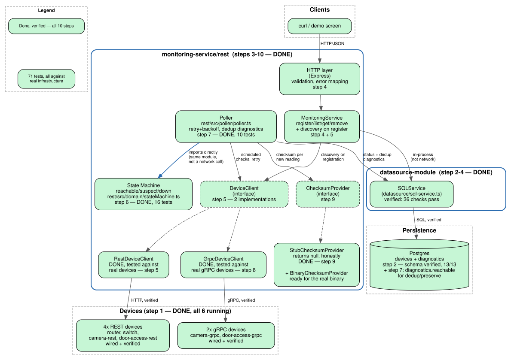

# UniFi Device Monitoring — Trade-Show PoC

A device monitoring service for a trade-show booth: checks whether
network devices (routers, switches, cameras, door access controllers)
are online, over REST and gRPC, persists state and diagnostics to
Postgres, and is built to run on unknown hardware with one command.

Built iteratively, one independently-testable step at a time. See
[`steps.md`](steps.md) for the full roadmap and current progress.

- [Quick start](#quick-start)
- [Project layout](#project-layout)
- [Testing](#testing)
- [Architecture](#architecture)
- [Progress](#progress)
- [Documentation index](#documentation-index)

---

## Quick start

```bash
./verify-clean-slate.sh
```

Wipes any existing containers and database, rebuilds everything from
nothing, and runs an end-to-end smoke test — devices come up, the API
registers and discovers them, the poller runs, and diagnostic
deduplication is verified. Takes a few minutes. See
[`scripts/`](scripts/) for testing individual pieces instead of the
whole system.

## Project layout

```
db/                    Postgres schema — its own module, own compose file
devices/                6 device simulators (4 REST, 2 gRPC)
monitoring-service/
├── datasource-module/   SQLService — all SQL lives here, nowhere else
└── rest/                HTTP API + poller + state machine + device clients
scripts/                Setup and test automation — see below
docs/                    Architecture diagrams, per-phase notes
dev-and-troubleshoot/    Working notes, troubleshooting history
```

Each top-level directory under `db/`, `devices/`, and
`monitoring-service/` has its own `README.md` with the reasoning behind
its specific design decisions — this file is the map, not the whole
territory.

## Testing

**The whole system, from nothing:**
```bash
./verify-clean-slate.sh          # interactive
./verify-clean-slate.sh --yes    # non-interactive, for CI/scripting
```
Destructive — tears down and rebuilds everything. This is the
pre-submission gate, not something to run against a live demo.

**One module at a time**, each usable standalone without the rest of
the system running:
```bash
./scripts/test-datasource-module.sh   # Postgres + the repository layer
./scripts/test-devices.sh              # the 6 device simulators
./scripts/test-rest.sh                 # HTTP API + poller + state machine
```
Each accepts `--keep` to leave its containers running afterward instead
of tearing them down — useful when you're about to run the next script
anyway, or want to poke around manually.

**A running deployment, without touching it:**
```bash
./scripts/health-check.sh
./scripts/health-check.sh --host 192.168.0.45   # a remote deployment
```
Read-only. This is the one safe to run against the actual trade-show
setup while it's live — everything else in `scripts/` rebuilds things.

**Automated test suites directly**, if you're iterating on one module:
```bash
cd monitoring-service/datasource-module && npm test   # 36 checks
cd monitoring-service/rest && npm test                 # 71 tests
```
(`rest`'s suite needs `TEST_DATABASE_URL` set and real devices running
— see [`scripts/test-rest.sh`](scripts/test-rest.sh) for the exact
setup it does automatically.)

## Architecture



Green is done and verified; gray dashed is not built yet. See
[`docs/step-1-to-10/`](docs/step-1-to-10/) for the state machine's
transition diagram and further detail.

## Progress

See [`steps.md`](steps.md) for the authoritative, up-to-date checklist.
As of this writing: all 10 steps complete and verified against real
infrastructure (not mocks) throughout — real Postgres, real device
processes, real HTTP and gRPC calls. Nothing outstanding on the roadmap.

## Documentation index

| Doc | What's in it |
|---|---|
| [`steps.md`](steps.md) | The roadmap and current progress |
| [`db/README.md`](db/README.md) | Schema design, the two "status" columns, dedup |
| [`devices/README.md`](devices/README.md) | The 6 simulators, how to run them individually |
| [`monitoring-service/rest/src/poller/README.md`](monitoring-service/rest/src/poller/README.md) | Poller design: retry/backoff, dedup, discovery-recovery |
| [`monitoring-service/rest/src/clients/README.md`](monitoring-service/rest/src/clients/README.md) | REST and gRPC device clients, the keepCase trap, proto duplication |
| [`monitoring-service/rest/src/checksum/README.md`](monitoring-service/rest/src/checksum/README.md) | The checksum seam, and why the stub returns null instead of a fake hash |
| [`monitoring-service/rest/test/LIFECYCLE_TEST.md`](monitoring-service/rest/test/LIFECYCLE_TEST.md) | The life-cycle test, and why the exit code is null |
| [`monitoring-service/rest/src/SERVICE_LIFECYCLE.md`](monitoring-service/rest/src/SERVICE_LIFECYCLE.md) | Startup, shutdown, config |
| [`dev-and-troubleshoot/`](dev-and-troubleshoot/) | Working notes, real bugs found and fixed, troubleshooting history |
