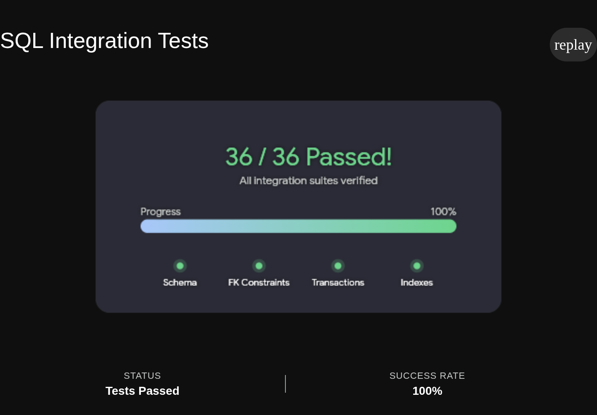

## Data Access Layer (`sql-service.ts`)
This module acts as the bridge between the PostgreSQL database and the Express web server. 
It encapsulates all raw SQL queries and cleanly maps database rows to TypeScript domain objects, 
ensuring the HTTP routes never have to interact directly with the database.

## 1. Make sure Postgres is Running
cd ../../db
podman-compose up -d
cd ../src/monitoring-service

## 2. Navigate to the Module & Install Dependencies
cd datasource-module
npm install

## 3. Run the Test
npm test

### Result
...
...
--- 9. Deleting, and cascade ---
ok  deleteDevice reports success
ok  device is gone
ok  its diagnostics were cascade-deleted
ok  deleting a missing device returns false

36 checks passed !!!

