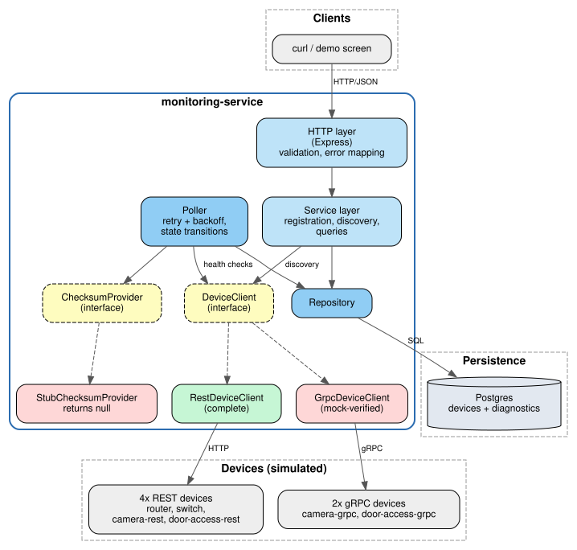
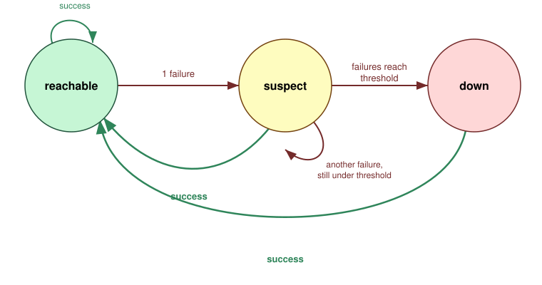
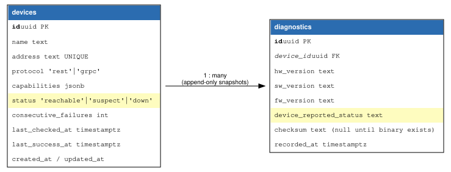
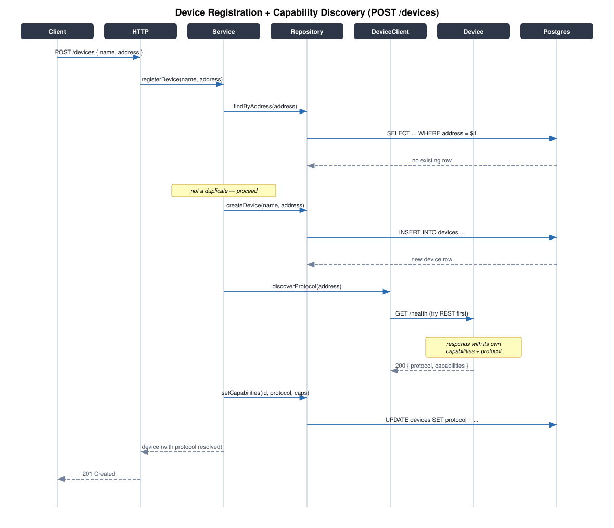
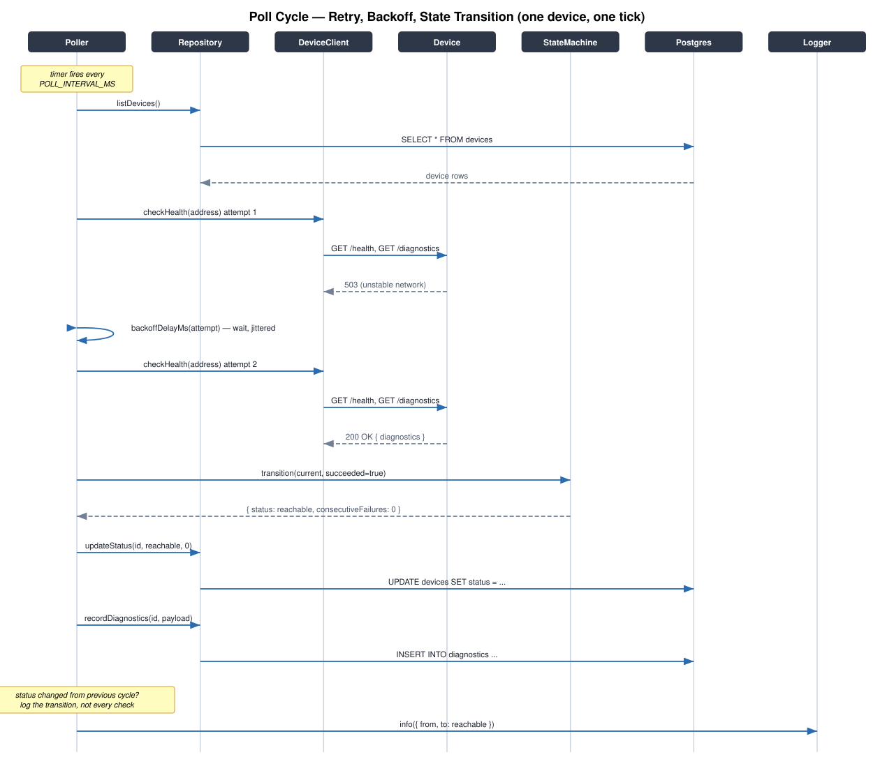
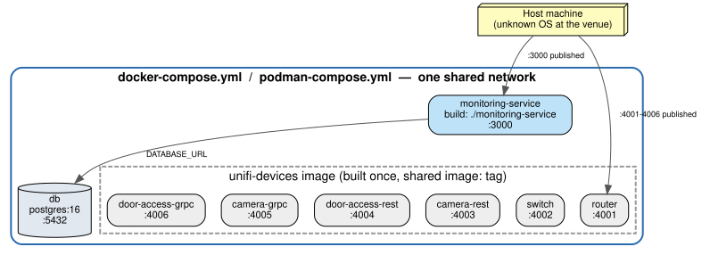

# Architecture & Design

This is the visual companion to [`specification.md`](specification.md) —
that document is the source of truth for API contracts and column-level
data model detail; this one is for understanding the shape of the system
before reading code.

- [System architecture](#system-architecture)
- [The state machine](#the-state-machine)
- [Data model](#data-model)
- [Sequence: device registration](#sequence-device-registration)
- [Sequence: poll cycle](#sequence-poll-cycle)
- [Deployment](#deployment)
- [Design decisions, in one table](#design-decisions-in-one-table)

---

## System architecture

Two interfaces carry the entire design: **`DeviceClient`** and
**`ChecksumProvider`**, shown as dashed yellow boxes above. Both exist
because the brief explicitly says the things behind them — gRPC
hardware, the checksum binary — aren't available yet and arrive later.
Nothing above either interface (the poller, the service layer) knows or
cares which concrete implementation it's talking to.

That's why `GrpcDeviceClient` can be shipped **mock-verified** (proven
against a simulator, never touched by real hardware) and
`StubChecksumProvider` can honestly return `null`, without either
compromise leaking into the rest of the codebase. The day real gRPC
hardware or the real checksum binary shows up, one file changes.

The **HTTP layer** and **Poller** are two independent entry points into
the same service and repository — a person calling `POST /devices` and
the scheduled poller both go through the identical `DeviceClient` /
`ChecksumProvider` seam, which is what keeps "a human just registered a
device" and "the poller just found it again after an outage" behaving
identically rather than as two parallel code paths that could drift.

## The state machine

This diagram **is** the answer to the brief's "some devices are behind
unstable networks, so plan for it, we don't want false alarms."

The asymmetry is the whole point: reaching `down` requires *accumulated
evidence* (the top path, red, requires the failure count to cross a
threshold) while recovering to `reachable` requires only *one success*
(the bottom paths, green, fire immediately). A flaky link produces a lot
of `suspect` and hardly ever produces `down`; a genuinely dead device
still reaches `down`, just not on the first missed check.

Full reasoning, including why that asymmetry was chosen deliberately
rather than symmetric thresholds in both directions, is in
[`assumptions.md`](assumptions.md) #4.

## Data model

The two highlighted rows are deliberately two different columns, not
one. `devices.status` is this service's own verdict, computed by the
state machine above. `diagnostics.device_reported_status` is what the
device says about *itself*, independent of whether the service can
reach it — a switch can be fully `reachable` while self-reporting
`degraded`. Collapsing these into a single field would lose exactly the
distinction an operator needs at the booth. Full reasoning in
[`assumptions.md`](assumptions.md) #8.

`diagnostics` rows are append-only snapshots rather than columns bolted
onto `devices`, so a new reading never overwrites the history the brief
says should be inspectable offline.

## Sequence: device registration

Two things worth noticing in this flow that aren't obvious from the API
contract alone:

- **The duplicate check happens before the insert**, not as a database
  constraint discovered after the fact — the `UNIQUE` constraint on
  `address` is a second line of defense, not the primary one, so the
  API can return a clean `409` with a clear message instead of a raw
  constraint-violation error.
- **Capability discovery happens inline during registration**, but
  registration still succeeds even if it fails (not shown as a branch
  here for clarity — see the sequence-poll-cycle diagram and
  `assumptions.md` #10 for what happens next: the poller retries
  discovery on a later cycle rather than the registration call blocking
  or failing).

## Sequence: poll cycle

This is one tick of the poller, for one device, showing the two
false-alarm defenses working at their different timescales in the same
flow:

1. **Attempt 1 fails, attempt 2 succeeds** — bounded retry with jittered
   backoff absorbs a single blip *within* this one check, before the
   state machine ever sees a failure.
2. **The transition is only logged when the status actually changes** —
   a device that's been `reachable` for an hour doesn't produce an hour
   of identical log lines, only the moments that matter.

If attempt 2 had also failed, this same diagram continues past the
`transition()` call with `succeeded=false` instead — the state machine
diagram above shows exactly what that produces depending on how many
consecutive failures have already accumulated.

## Deployment

One image for all six device simulators (`unifi-devices`), built once
and reused via a shared `image:` tag rather than six separate `build:`
stanzas — see `devices/docker-compose.yml` and the root
`docker-compose.yml` for the same pattern applied at both scopes. The
monitoring service is a second, separate image, since it compiles
ahead of time and ships without dev dependencies — a deliberate
asymmetry explained in `monitoring-service/README.md`.

Every port in this diagram is published to the host, which is what
makes "get it up and running quick and easy" on unknown venue hardware
actually true: nothing here requires the host to have Node.js, only a
container runtime.

## Design decisions, in one table

| Decision | Where it shows up above | Why (full reasoning) |
|---|---|---|
| Two interfaces for the two incomplete integrations | Architecture diagram | `assumptions.md` #2, #3 |
| Three states, not two | State machine | `assumptions.md` #4 |
| Failure needs evidence; recovery doesn't | State machine | `assumptions.md` #4 |
| Two status columns, not one | Data model | `assumptions.md` #8 |
| Diagnostics are append-only | Data model | `specification.md` — data model |
| Registration succeeds even if discovery fails | Registration sequence | `assumptions.md` #10 |
| Retry+backoff *and* a multi-cycle threshold | Poll cycle sequence | `specification.md` — reliability |
| Log transitions, not checks | Poll cycle sequence | `specification.md` — logging |
| One shared image for 6 devices | Deployment | `devices/Dockerfile`, `devices/docker-compose.yml` |
