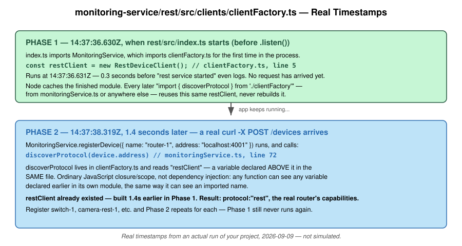
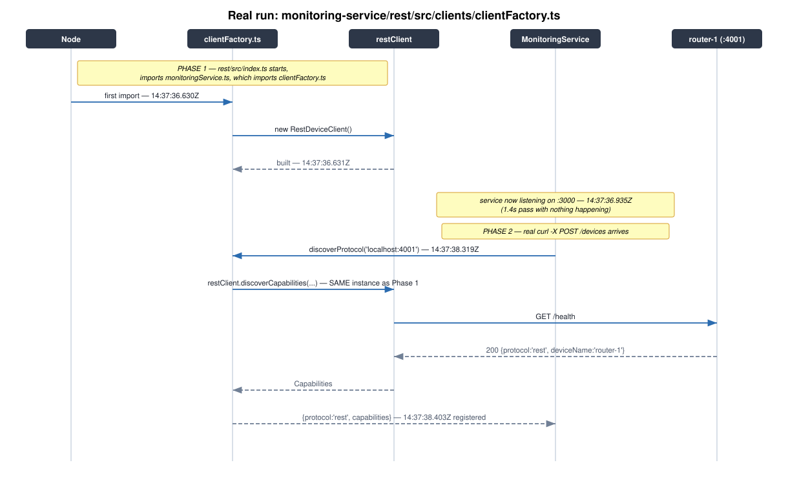
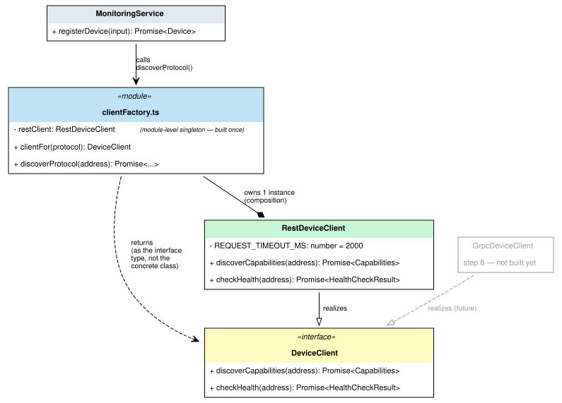

# The `restClient` Singleton — Explained With Your Actual Code

This isn't a toy example. Every log line below came from running your
real, uploaded `monitoring-service/rest`, against a real Postgres and a
real `router-1` device, with exactly two temporary `console.log` lines
added to `clientFactory.ts` and nothing else touched.

## The two lines that were added, temporarily

```diff
+ console.log(`[clientFactory.ts] module loading — about to build restClient — ${new Date().toISOString()}`);
  const restClient = new RestDeviceClient();
+ console.log(`[clientFactory.ts] restClient built — this happens ONCE, ever — ${new Date().toISOString()}`);
```

```diff
  export async function discoverProtocol(address: string) {
+   console.log(`[clientFactory.ts] discoverProtocol(${address}) called — reusing the restClient built earlier — ${new Date().toISOString()}`);
    const capabilities = await restClient.discoverCapabilities(address);
```

Confirmed by diff against your uploaded file — nothing else in the
project was changed for this.

## What actually happened, timestamped

```
[clientFactory.ts] module loading — about to build restClient — 14:37:36.630Z
[clientFactory.ts] restClient built — this happens ONCE, ever — 14:37:36.631Z
{"level":"info","msg":"rest service started","port":3000}         14:37:36.935Z

    ... 1.4 seconds pass. Service is up. Nothing else happens. ...

[clientFactory.ts] discoverProtocol(localhost:4001) called — reusing the restClient built earlier — 14:37:38.319Z
{"level":"info","msg":"device registered","protocol":"rest"}       14:37:38.403Z
```

Real response from the real `curl`:
```json
{"id":"d2e1376f-...","name":"router-1","address":"localhost:4001","protocol":"rest","capabilities":{"protocol":"rest","deviceName":"router-1","capabilities":["diagnostics-ts"]},"status":"reachable", ...}
```

## Reading this against your actual files

| Time | What ran | Where (real file/line) |
|---|---|---|
| `36.630Z` | `clientFactory.ts` loaded for the first time | triggered by `rest/src/index.ts` → imports `MonitoringService` → imports `clientFactory.ts` |
| `36.631Z` | `const restClient = new RestDeviceClient();` executes | `clientFactory.ts` line 5 |
| `36.935Z` | `app.listen(...)` callback fires | `rest/src/index.ts`, inside `start()` |
| `38.319Z` | `discoverProtocol(device.address)` called | `monitoringService.ts` line 72, inside `registerDevice` |
| `38.319Z` | same line reads `restClient` — no new instance made | `clientFactory.ts`, inside `discoverProtocol` |
| `38.403Z` | response returned, logged, sent to curl | back through `registerDevice` → `http/app.ts` |

The gap between `36.631Z` (restClient built) and `38.319Z` (restClient
actually used) is the whole point: **by the time anyone calls
`discoverProtocol`, `restClient` isn't being constructed — it's 1.4
seconds old already**, sitting in `clientFactory.ts`'s module scope,
waiting.

## Diagrams, using your real files and this real run



The two-phase split, now labeled with your actual file paths and the
real timestamps above, not placeholder times.



The same real run as a sequence diagram — `router-1 (:4001)` is the
actual device container from your `devices/` folder, not a stand-in.



Unchanged from before — this one was already built from your real
class/interface names (`DeviceClient`, `RestDeviceClient`,
`MonitoringService`, `clientFactory.ts`), so there was nothing to
re-derive.

## The takeaway, tied back to step 5

This is also, incidentally, why the network bugs we found earlier
produced exactly the symptom they did. `restClient` existing early and
staying alive was never in question — the `[clientFactory.ts]
discoverProtocol(...) called` line would have printed regardless of
whether `router:4001` was reachable. What failed was purely the
`fetch()` call *inside* `discoverCapabilities` — a separate concern
from whether `restClient` itself existed. Worth keeping those two
things mentally separate: "is the singleton built" and "can the
singleton reach the network" are never the same question, even though
a failure in the second one can look confusing if you're still
unsure about the first.
