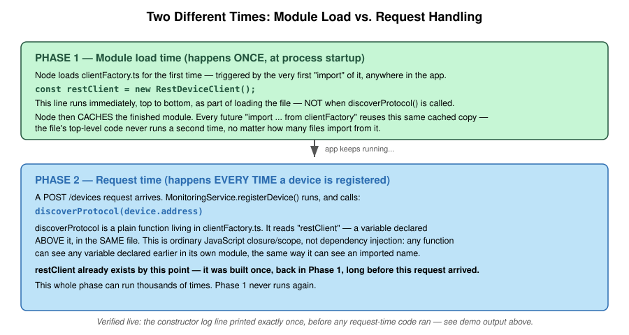
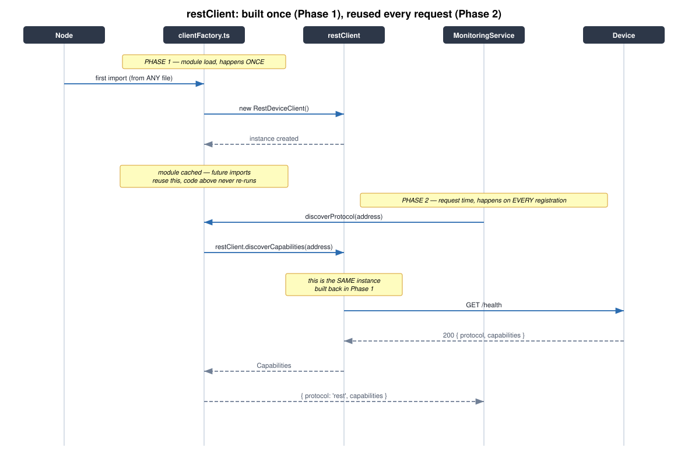

# Understanding `restClient`: Module-Level Singletons

## The question

In `clientFactory.ts`:

```typescript
const restClient = new RestDeviceClient();

export async function discoverProtocol(address: string) {
  const capabilities = await restClient.discoverCapabilities(address);
  return { protocol: "rest", capabilities };
}
```

`discoverProtocol` never receives `restClient` as a parameter, and
nothing ever explicitly "wires" one in. So where does it come from when
the function runs?

## The answer, in one sentence

**`restClient` is built once, the moment this file is first loaded —
before `discoverProtocol` is ever called — and every call to
`discoverProtocol` afterward just reads that same already-built
variable, the same way it could read any other variable declared above
it in the file.**

This isn't dependency injection, a framework feature, or anything
specific to this codebase. It's two ordinary JavaScript/TypeScript
behaviors combined:

1. **Closures** — a function can see any variable declared in the same
   scope it was defined in, even after that outer code has finished
   running. `discoverProtocol` was defined in the same file as
   `restClient`, so it can see `restClient` forever.
2. **Module caching** — Node.js runs a file's top-level code (like
   `const restClient = new RestDeviceClient()`) exactly once, the
   first time *any* file imports it. Every subsequent `import` — from
   any other file, anywhere in the app — gets the same cached result,
   not a fresh re-run.

## Proved, not just asserted

`demo1-basic.ts` — the pattern stripped to its essence, run for real:

```typescript
class Greeter {
  constructor() { console.log("[Greeter constructor running]"); }
  greet(name: string) { return `hello, ${name}`; }
}
const singleton = new Greeter();          // <- runs once, immediately
export function useSingleton(name: string) { return singleton.greet(name); }

console.log("--- file finished loading, now calling the function ---");
console.log(useSingleton("Alice"));
console.log(useSingleton("Bob"));
console.log(useSingleton("Carol"));
```

Actual output:

```
[Greeter constructor running]
--- file finished loading, now calling the function ---
hello, Alice
hello, Bob
hello, Carol
```

The constructor line appears **once**, *before* the three calls — not
once per call. That's the whole mechanism.

`caller-A.ts` / `caller-B.ts` — proving it stays true across *separate*
files, which is the situation your real code is actually in
(`monitoringService.ts` importing from `clientFactory.ts`):

```
=== main.ts starting ===
[Greeter constructor running — only on first import]
[caller-A] importing shared-module...
[caller-A] hello, from A
[caller-B] importing shared-module...
[caller-B] hello, from B
=== main.ts done ===
```

Two different files both import the same module. The constructor still
only runs once — `caller-B`'s import reused the copy `caller-A`'s
import had already created.

## Model — the two-phase timeline



This is the mental model worth keeping: **Phase 1 (module load) runs
once, ever. Phase 2 (handling a request) runs every time, and always
finds Phase 1 already finished.** By the time any `POST /devices`
request reaches `discoverProtocol`, `restClient` isn't being created —
it's already existed for as long as the process has been running.

## Flow — one request, start to finish



Same story as a concrete sequence: Node imports `clientFactory.ts`
once at startup, which builds `restClient`. Every later request just
reuses it — `MonitoringService` never sees `restClient` directly, only
the `discoverProtocol` function, which quietly closes over it.

## UML — the class relationships


The two relationships worth naming explicitly:

- **`RestDeviceClient` *realizes* `DeviceClient`** (open-triangle arrow)
  — it implements the interface. `GrpcDeviceClient` will do the same
  in step 8, which is the entire reason the interface exists: so
  `MonitoringService` can depend on the interface and never need to
  change when a second implementation shows up.
- **`clientFactory.ts` *owns* one `RestDeviceClient` instance**
  (filled-diamond arrow — composition) — this is `restClient`. Nothing
  else in the app creates a `RestDeviceClient`; everything else goes
  through `discoverProtocol`/`clientFor`, which hand back the single
  shared instance, typed as the `DeviceClient` interface rather than
  the concrete class (the dashed arrow) — callers depend on the
  contract, not the implementation.

## Why this pattern, instead of passing `restClient` around explicitly

Worth knowing the trade-off, not just the mechanism. The alternative
would be constructing a `RestDeviceClient` somewhere (say, in
`index.ts`) and passing it into `MonitoringService`'s constructor —
that's called **dependency injection**, and it's what `SQLService` and
`Logger` actually do in this codebase (`MonitoringService(sql, log)`).

`restClient` doesn't get that treatment because nothing about it varies
per request or needs to be swapped out in a test the way the database
connection does — every part of the app that needs a REST device
client needs the *exact same* one, so a module-level singleton is
simpler than threading it through every constructor for no benefit.
`clientFor(protocol)` is the one place that *does* need to choose
between implementations (REST vs. gRPC, from step 8), which is exactly
why that seam is a function call rather than another singleton.
